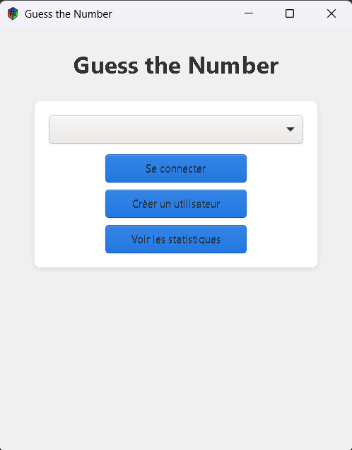
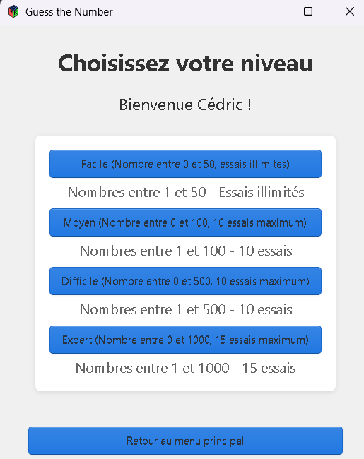
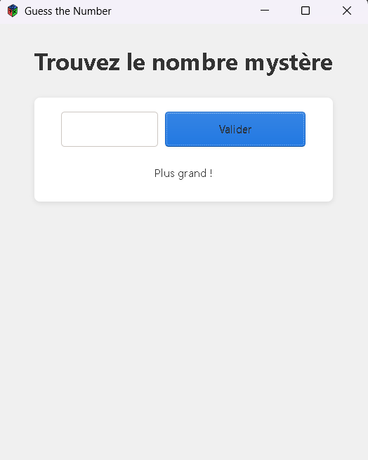
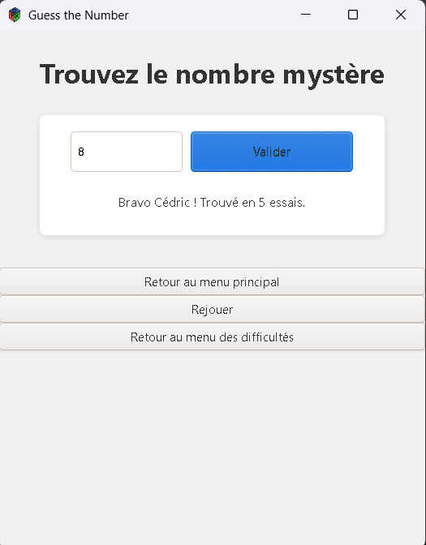
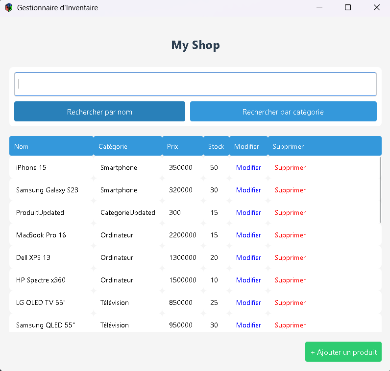
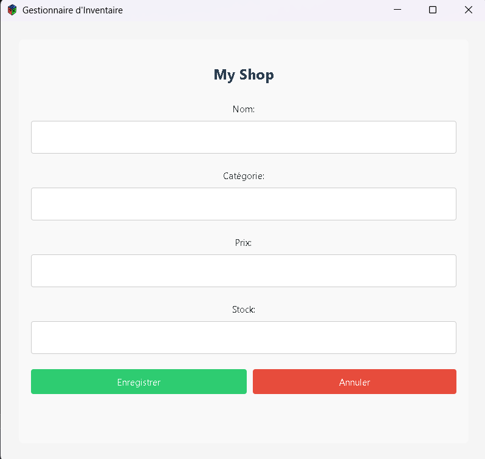
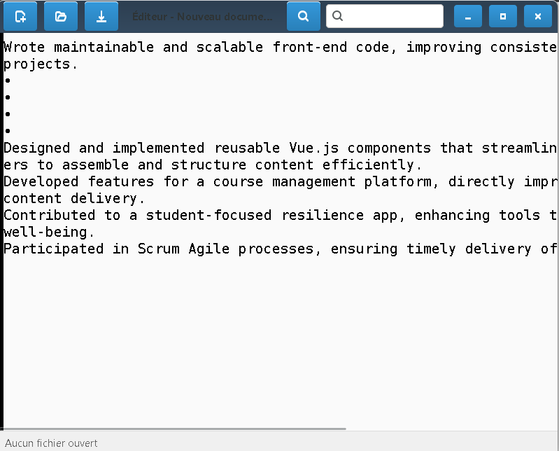
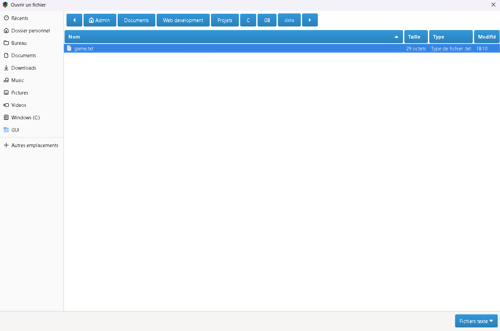

# README du Projet MultiProject

## 1. Introduction

Ce projet se compose de plusieurs sous-projets développés en langage C, organisés en trois parties principales : **Console**, **GUI** (Interface Graphique), et **Tests**. Chaque sous-projet a une responsabilité spécifique, et les fichiers sources sont organisés de manière modulaire pour faciliter l'extension et la maintenance du projet.

Les sous-projets ont été réalisés par deux développeurs pour une bonne gestion des projets en équipe.
Par ailleurs chaque groupe à éffectuer son travail sur un branche portant le nom du sous projet traité la version finale se trouvant sur la branche principale main.

**Gérald** et **Gracia** : Responsable du sous-projet **Inventaire**
Gestion d'un inventaire de magasin
● Description : Créer un système de gestion d'inventaire pour un magasin. Chaque produit
est représenté par une structure contenant un nom, une catégorie, un prix, et une quantité
en stock.
● Fonctionnalités :
○ Ajouter des produits à l'inventaire (nom, catégorie, prix, quantité).
○ Modifier la quantité ou le prix des produits existants.
○ Supprimer des produits de l’inventaire.
○ Rechercher des produits par catégorie ou nom.
○ Enregistrer et charger l'inventaire depuis/vers un fichier binaire.
● Concepts utilisés : Structures, tableaux dynamiques (gestion dynamique de la mémoire
avec malloc() et realloc()), fichiers binaires, pointeurs.

- **Mac-Aurel** et **Hayat** : Responsable du sous-projet **blocNote**
  Gestionnaire de fichiers texte
  ● Description : Créer un programme qui permet de manipuler des fichiers texte. L'application
  doit permettre de créer, modifier, et afficher le contenu de fichiers texte. Le programme
  doit également pouvoir rechercher des mots spécifiques dans le fichier.
  ● Fonctionnalités :
  ○ Créerunnouveaufichier texte ou ouvrir un fichier existant.
  ○ Lireet afficher le contenu d’un fichier texte.
  ○ Ajouter dutexte à un fichier existant.
  ○ Rechercher un motspécifique dans le fichier et afficher le nombre d'occurrences.
  ○ Sauvegarder les modifications.
  ● Concepts utilisés : Fichiers texte, manipulation de chaînes de caractères, pointeurs,
  boucles et conditions

  **Mardiath** et **Gracelle** : Responsable du sous-projet **Game**
  Jeu de devinette (Guess the Number)
  ● Description : Créer un jeu où l'utilisateur doit deviner un nombre secret choisi par le
  programme dans un intervalle donné. Le programme indique si le nombre proposé est trop
  haut ou trop bas.
  ● Fonctionnalités :
  ○ Leprogrammechoisit un nombre aléatoire entre 1 et 100.
  ○ L’utilisateur propose un nombre et le programme indique si le nombre est trop petit
  ou trop grand.
  ○ Lejeusetermine lorsque l’utilisateur trouve le bon nombre.
  ○ Ajouter un compteur pour afficher le nombre de tentatives avant que l'utilisateur ne
  devine correctement.
  ○ Proposer derejouer ou quitter le jeu à la fin de chaque partie.
  ● Concepts utilisés : Génération aléatoire de nombres avec rand(), structures de contrôle
  (boucles et conditions), gestion d'entrées utilisateur, modularité des fonctions.

  Les interfaces graphiques ont été réalisé par Gérald GUIDI

## 2. Architecture du projet

Le projet est organisé de la manière suivante :

```
src/
    ├── console
    ├── IG
tests/
    ├── game.c
    ├── inventory.c
    └── blocNote.c
include/
    ├── game.h
    ├── inventory.h
    ├── blocNote.h
util/
    ├── game.c
    ├── inventory.c
    ├── global.c
    └── blocNote.c
styles/
    └── styles.css
```

### Structure des répertoires :

- **`src/console/`** : Contient les fichiers sources de l'application: `inventory.c`, `game.c`, `blocNote.c`.
- **`src/GUI/`** : Contient les fichiers sources pour l'interface graphique utilisant GTK: `GUI_inventory.c`, `GUI_game.c`, `GUI_blocNote.c`.
- **`src/util/`** : Contient les fichiers utilitaires partagés entre les applications console et GUI: `inventory.c`, `global.c`, `game.c`, `blocNote.c`.
- **`tests/`** : Contient les tests unitaires pour valider le bon fonctionnement des différentes fonctionnalités du projet.
- **`include/`** : Contient les fichiers d'en-tête (.h) utilisés par les différents sous-projets.

## 3. Interface Graphique (GUI) : GTK

GTK (GIMP Toolkit) est une bibliothèque utilisée pour créer des interfaces graphiques (GUI). Elle est largement utilisée sous Linux et permet de créer des applications multiplateformes.

### Installation de GTK

L'installation de GTK dépend du système d'exploitation utilisé.

#### Sur Linux (Ubuntu/Debian)

Vous pouvez installer GTK à l'aide de `apt` :

```bash
sudo apt-get update
sudo apt-get install libgtk-3-dev pkg-config
```

#### Sur macOS

Sur macOS, GTK peut être installé via `Homebrew` :

```bash
brew install gtk+3
```

#### Sur Windows

Pour installer GTK sur Windows, il est recommandé de télécharger les précompilés depuis le site officiel de GTK ou d'utiliser un gestionnaire de paquets comme MSYS2.

### Documentation de GTK

Pour plus de détails sur l’utilisation et l'installation de GTK, vous pouvez consulter la documentation officielle à l’adresse suivante :
[https://developer.gnome.org/gtk3/stable/](https://developer.gnome.org/gtk3/stable/)

## 4. Compilation du Projet

### Pré-requis

Avant de commencer à compiler le projet, vous devez installer **CMake**. CMake est un système de génération de makefiles qui facilite la compilation sur différentes plateformes.

#### Installation de CMake

- **Sur Ubuntu/Debian** :

  ```bash
  sudo apt install cmake
  ```

- **Sur macOS** :

  ```bash
  brew install cmake
  ```

- **Sur Windows** :
  Téléchargez l'installateur depuis le site officiel de CMake [https://cmake.org/download/](https://cmake.org/download/) et suivez les instructions d'installation.

### Compilation via CMake

Une fois CMake installé, vous pouvez compiler le projet en suivant ces étapes :

1. **Générer les fichiers de configuration** :
   Dans le terminal, à la racine du projet, exécutez la commande suivante pour générer les fichiers nécessaires à la compilation :

   ```bash
   cmake -S . -B build
   ```

2. **Compiler les exécutables** :
   Ensuite, lancez la commande suivante pour compiler le projet et générer les exécutables :

   ```bash
   cmake --build build
   ```

Les exécutables seront générés dans les répertoires `console`, `GUI`, et `tests` respectivement sous le répertoire `build`.

### Compilation manuelle sans CMake

Si vous ne souhaitez pas utiliser CMake, vous pouvez compiler manuellement chaque sous-projet en utilisant les commandes suivantes après avoir créer les répertoires build build/console build/test build/GUI :

- **Console** :

  ```bash
  gcc -Iinclude src/console/inventory.c util/inventory.c util/global.c -o build/console/console_inventory
  gcc -Iinclude src/console/game.c util/game.c util/global.c -o build/console/console_game
  gcc -Iinclude src/console/blocNote.c util/blocNote.c util/global.c -o build/console/console_blocNote
  ```

- **GUI** (avec GTK) :

  ```bash
  gcc -Iinclude src/GUI/GUI_inventory.c util/inventory.c -o build/GUI/gui_inventory $(pkg-config --cflags --libs gtk+-3.0)
  gcc -Iinclude src/GUI/GUI_game.c util/game.c -o build/GUI/gui_game $(pkg-config --cflags --libs gtk+-3.0)
  gcc -Iinclude src/GUI/GUI_blocNote.c util/blocNote.c -o build/GUI/gui_blocNote $(pkg-config --cflags --libs gtk+-3.0)
  ```

- **Tests** :
  ```bash
  gcc -Iinclude tests/inventory.c util/inventory.c -o build/tests/test_inventory -lm
  gcc -Iinclude tests/game.c util/game.c -o build/tests/test_game -lm
  gcc -Iinclude tests/blocNote.c util/blocNote.c -o build/tests/test_blocNote
  ```

## 5. Compilation des Tests Unitaires

Avant de compiler les applications **console** et **GUI**, il est conseillé de commencer par compiler les tests unitaires, car ils sont essentiels pour remplir les fichiers constituant une base de données utilisée par l'application.

Pour compiler les tests unitaires, suivez les instructions ci-dessus sous la section **Compilation manuelle**. Une fois les tests compilés, vous pouvez les exécuter pour vérifier que les différentes fonctionnalités du projet fonctionnent comme prévu.

Exécuter les tests unitaires garantit que les données nécessaires à la bonne exécution des autres sous-projets (comme les applications console et GUI) sont bien présentes et valides.

---

## 6. 🖼️ Application Previews

### Game
---
#### 🏠 Home Page



---

#### 📅 Menu Page



---

#### 🔔 Game Page

Stay up to date with interactions, comments, and activity.



---


### Inventory
---
#### List Page

---
#### Add Page

---
### BlocNote
---
#### Page


  
---

## 7. Conclusion

Ce projet multi-sous-projets permet de mieux comprendre l'organisation d'un projet C utilisant des interfaces graphiques (via GTK) et des tests unitaires. En suivant les instructions de ce README, vous pourrez configurer et compiler le projet, ainsi que tester les différentes applications développées.

N'oubliez pas d'installer GTK et CMake, puis suivez les étapes de compilation pour générer les exécutables nécessaires à l'exécution du projet.
